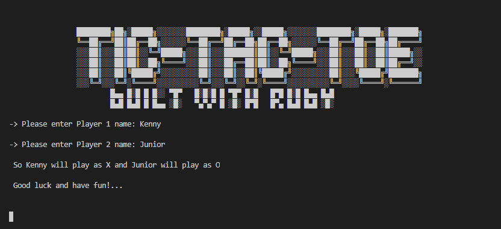
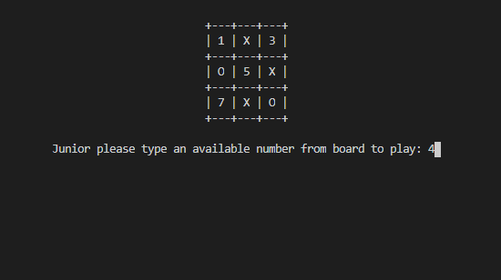
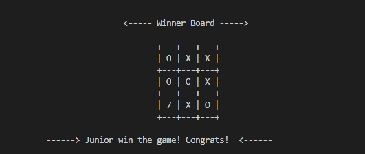
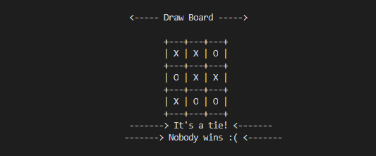

?style=plastic&logo=ruby>) 

# Project - Tic Tac Toe

> This project is to validate that we have acquired knowledge of the Ruby programming language specifically OOP. With the skills achieved, they permits us to develop a Video Game development project called Tic Tac Toe. 

> Building this project helps to show that we have achieved or learned the correct operation of Object Oriented Programming in Ruby.

> This is the 3rd project that we work on Ruby so we can move on into the Microverse Program

# Screenshots

> **Homescreen**
>

> **Gameplay**
>

> **Winner**
>

> **Draw**
>

# Built With

- ?style=plastic&logo=ruby>)

# Live Demo

[Live Demo Link](https://replit.com/@KennyOrtega/tic-tac-toe-ruby#bin/main.rb)

# Getting Started

- First you need to download and install the Ruby enviroment from here [Get Ruby](https://www.ruby-lang.org/en/downloads/)
- Clone the repository into your local machine using _git clone_ in the Git Bash or using the Desktop app from Github

## Prerequisites

- You need internet connection to download the neccesary resources
- Working PC or laptop running Windows, MAC OS or any Linux Distro
- Download and install the Ruby enviroment from here [Get Ruby](https://www.ruby-lang.org/en/downloads/)

## Install

> Getting Started To get a local copy up and running follow these simple example steps:

- You need to clone or [download as zip](https://github.com/kensayo/tic-tac-toe-ruby/archive/refs/heads/Development.zip) file the repository on your device.
- Unzip the repository or just clone it using git or github.
- And that's it the game would be installed in your computer

## Usage

> To play the game you just need run the _main.rb_ with Ruby and start to play!

# What is Tic - Tac - Toe?

> Tic-tac-toe is a paper-and-pencil game for two players, X and O, who take turns marking the spaces in a 3×3 grid. The player who succeeds in placing three of their marks in a diagonal, horizontal, or vertical row is the winner. It is a solved game with a forced draw assuming best play from both players.

# How to run the game

- You will play the game from your computer termina (yes!, like a hacker 👨🏻‍💻). You can open the terminal from your start menu or searching (everything depends on the OS you are runnig)
- Now you need to move into the game's folder, so you need to know where it is. You can move using the command _cd_ to move inside the folder, also use the _ls_ to list all the files inside the folder.
- Now, move into _bin_ folder by typying _cd bin_ and executing the command _ruby main.rb_ in the terminal to start the game. Or, you can just type _ruby bin/main.rb_ without change to bin directory.
- That's it, so let's play! and have fun!

# Rules for playing

- Type the name for Player 1, and it will be assigned the symbol 'X';
- Type the name for Player 2, and it will be assigned the symbol 'O';
- Now the first player can select any cell in the range of (1-9) to put his/her mark (X in this case)
- Remember to insert a valid number (from 1 to 9) and don't repeat any number that is already taken by a symbol;
- The first player to complete three marks in a row, column, or diagonal line will be the winner.

# Authors

## 👤 Kenny Ortega

- GitHub: [kensayo](https://github.com/kensayo)
- Twitter: [@kensayo](https://twitter.com/kensayo)
- LinkedIn: [LinkedIn](https://www.linkedin.com/in/kennyortega/)

## 👤 Fondem Junior**

- Github: [@Fondem-Jr](https://github.com/Fondem-Jr)
- Twitter: [@OpportunistZeus](https://twitter.com/Zeus)
- Linkedin: [Fondem Junior](www.linkedin.com/in/fondem-junior-57484744)

## 🤝 Contributing

Contributions, issues, and feature requests are welcome!

Feel free to check the [issues page](../../issues/).

## Show your support

Give a ⭐️ if you like this project!

## Acknowledgments

- Hat tip to anyone whose code was used
- Inspiration
- etc

## 📝 License

This project is [MIT](./MIT.md) licensed.
